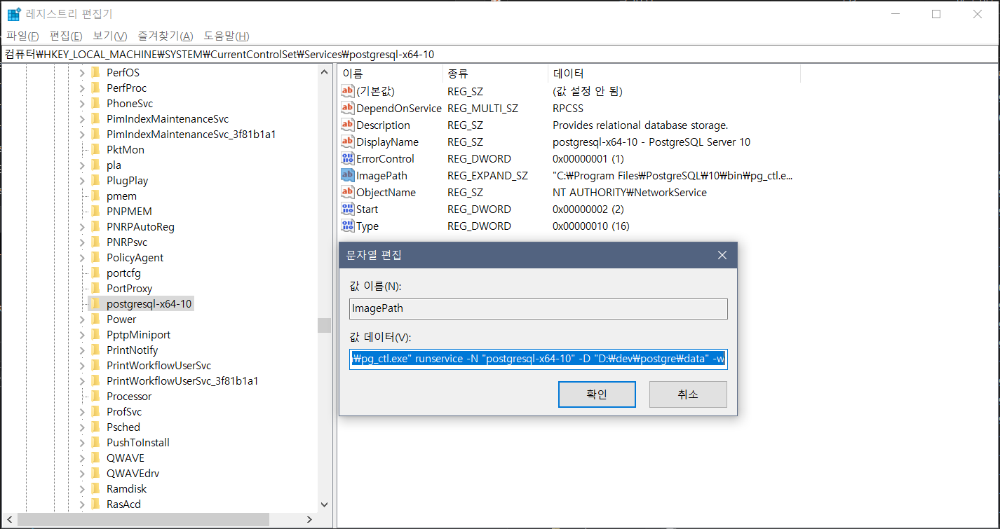

# PostgreSQL Data Directory 변경하기.

Windows 기반의 로컬 서버와 테스트 서버에서 돌리는 PostgreSQL의 Data 저장경로가 C로 잡혀 있었음.  
D 드라이브로 옮길 필요가 있어서 열심히 구글링 했으나,  
거의 대부분의 자료가 Linux 기반이고, PostgreSQL의 버젼도 구버젼인 경우가 많아서 내가 정리 해보고자 함.

## 진행 환경

OS : Windows10, Windows Server 2008 R2 Standard  
DB : PostgreSQL 10.10, compiled by Visual C++ build 1800, 64-bit, PostgreSQL 11.5, compiled by Visual C++ build 1914, 64-bit

## 진행

---

1.  PostgreSQL 데이터 저장경로 확인
    
    -   SQL Shell을 실행 접속 후, **show data\_directory;** 명령을 내리면 현재 PostgreSQL이 데이터를 저장하는 경로를 알려줌.
    
    ```
     Server [localhost]:
     Database [postgres]:
     Port [5432]:
     Username [postgres]:
     postgres 사용자의 암호:
     psql (10.10)
     도움말을 보려면 "help"를 입력하십시오.
    
     postgres=# show data_directory;
       data_directory
     ---------------------
     C:\Program Files\PostgreSQL\10\data
     (1개 행)dit
    ```
    
    -   경로 확인후 SQL Shell 종료.

---

2.  PostgreSQL 서버 종료.
    
    -   다른 버젼은 모르겠지만 일단 PostgreSQL 서버 종료방법 찾기도 쉽지 않았음.
        
    -   PowerShell을 **관리자 권한**으로 실행 한 뒤  
        PostgreSQL의 설치 경로 하위의 scripts 경로로 들어감.
        
        ```
         PS C:\WINDOWS\system32> cd 'C:\Program Files\PostgreSQL\10\scripts'
         PS C:\Program Files\PostgreSQL\10\scripts> .\serverctl.vbs stop
        
         Microsoft (R) Windows Script Host 버전 5.812
         Copyright (C) Microsoft Corporation. All rights reserved.
        
         postgresql-x64-10 - PostgreSQL Server 10 서비스를 멈춥니다..
         postgresql-x64-10 - PostgreSQL Server 10 서비스를 잘 멈추었습니다.
        ```
        

---

3.  현재 데이터 저장 경로의 하위 디렉토리를 새 디렉토리로 이동함.
    
    -   나의 경우는 1에서 확인한 디렉토리에서 **D:\\dev\\postgre\\data**로 복사.
    -   복사후, data 폴더를 우클릭 -> 속성보기 -> 보안 -> 사용권한이 잘 있는지 확인 해야 함. 일반적으로는 이상 없는듯.
        -   복사후, 이전 경로롸 새 경로의 권한이 같은지, 갖지 않다면 새 경로에 **권한 추가**를해 줘야 한다.

---

4.  설정 변경
    
    -   새로 옮긴 경로에서 postmaster.opts 파일(**D:\\dev\\postgre\\data\\postmaster.opts**)을  
        텍스트 편집기로 열어서, 다음과 같은 내용으로 변경해줌
        
        ```
         C:/Program Files/PostgreSQL/10/bin/postgres.exe "-D" "D:\dev\postgre\data"
        ```
        
        대충 실행파일 위치와 데이터 저장 위치를 표기하는 듯.
        

---

5.  레지스트리 변경
    
    -   레지스트리 편집기를 실행 후, **컴퓨터\\HKEY\_LOCAL\_MACHINE\\SYSTEM\\CurrentControlSet\\Services\\postgresql-x64-10** 경로까지 내려감.
      
    **ImagePath**를 선택 후 값을 변경해줌.
    
    ```
     "C:\Program Files\PostgreSQL\10\bin\pg_ctl.exe" runservice -N "postgresql-x64-10" -D "D:\dev\postgre\data" -w
    ```
    
    대충 3번과 같은 의미인듯 함.
    

---

6.  서버 재시작.
    
    -   2에서 실행한 경로에서 start 명령을 내려주면 됨.
    
    ```
     PS C:\Program Files\PostgreSQL\10\scripts> .\serverctl.vbs start
     Microsoft (R) Windows Script Host 버전 5.812
     Copyright (C) Microsoft Corporation. All rights reserved.
    
     postgresql-x64-10 - PostgreSQL Server 10 서비스를 시작합니다...
     postgresql-x64-10 - PostgreSQL Server 10 서비스가 잘 시작되었습니다.
    ```
    
    -   여기서 Server 2008의 경우는 권한을 안잡아 줘서 30분간 삽질했음.

---

7.  경로 확인.
	- 1에서 확인한 방법으로 PostgreSQL의 데이터 저장 경로가 새 경로인지 확인.
    
    ```
     postgres=# show data_directory;
       data_directory
     ---------------------
     D:/dev/postgre/data
     (1개 행)
    ```
    

## 참고 자료

-   `https://confluence.curvc.com/pages/viewpage.action?pageId=10092649`
-   `https://www.dbrnd.com/2016/08/postgresql-change-or-move-default-data-directory-in-windows-operating-system/`
-   `https://kugancity.tistory.com/entry/postgreSQL-%EB%8D%B0%EC%9D%B4%ED%84%B0-%EB%94%94%EB%A0%89%ED%86%A0%EB%A6%AC-%EB%B3%80%EA%B2%BD`