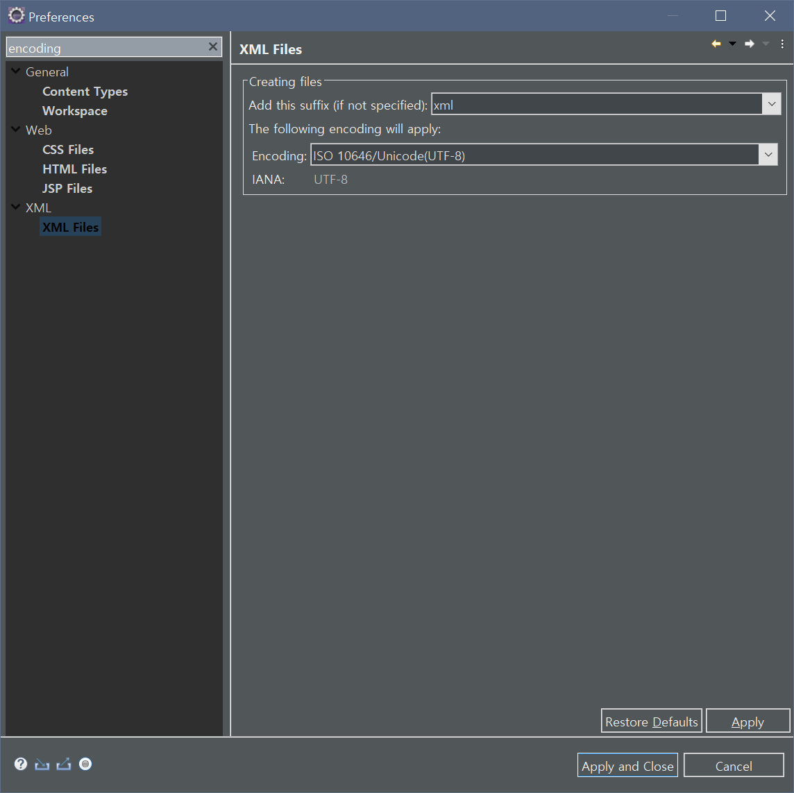

# Eclipse UTF-8 Encoding 설정
이클립스 인코딩을 UTF-8로 설정해 줘야 하는데, 설정해야 할 곳이 은근 많다.  
1. `Windows > Preferences > General > Content Types > Java Class File > Default Encoding`  
  
2. `Windows > Preferences > General > Editors > Spelling > Encoding`  
  
3. `Windows > Preferences > General > Workspace > Text File Encoding`  
  
4. `Windows > Preferences > Web > (CSS, HTML, JSP) > Encoding`  
  
4. `Windows > Preferences > XML > XML Files > Encoding`  
  
  