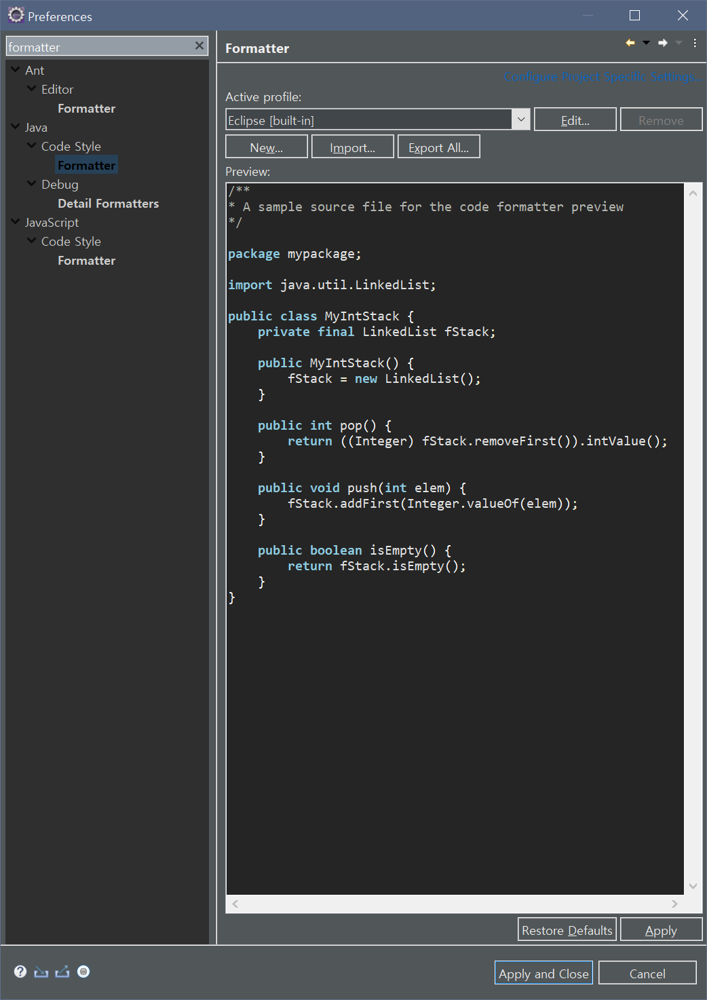
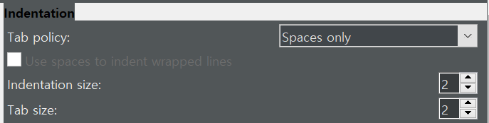
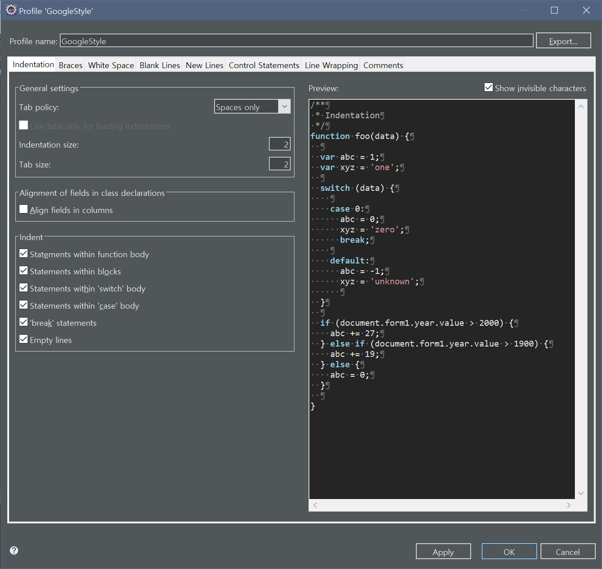
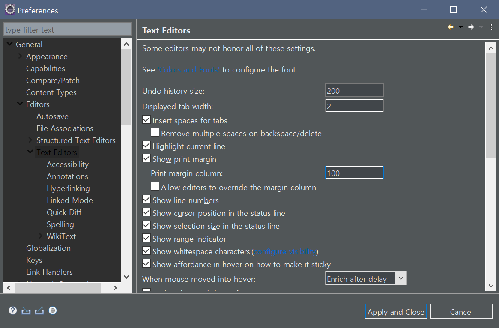
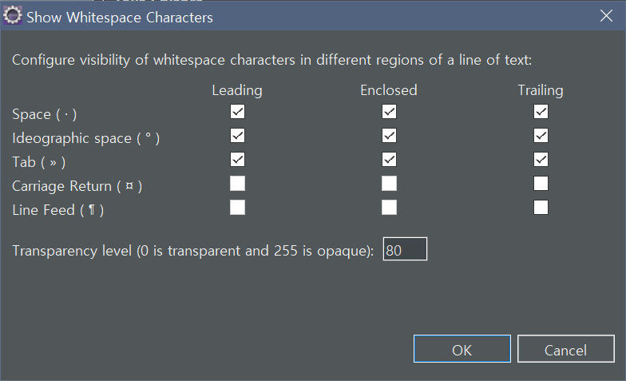
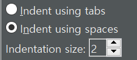
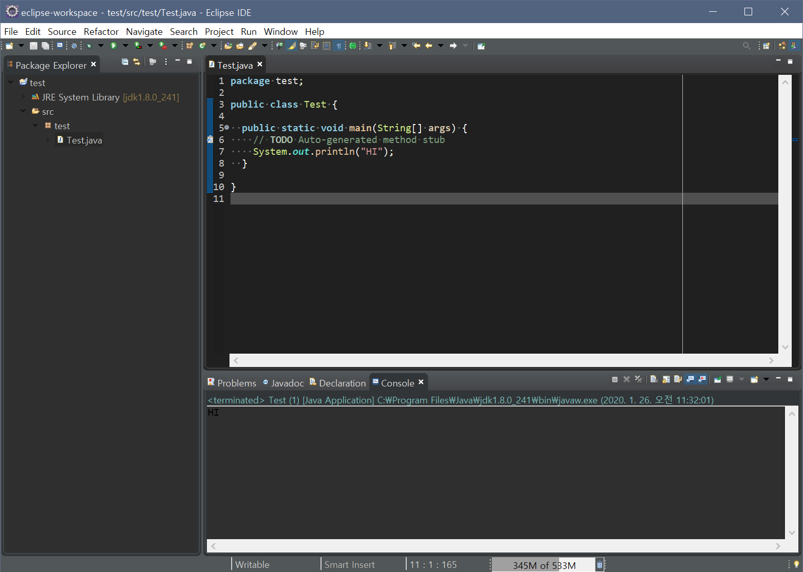

# Code Style Formatter와 Eclipse Text Editor 설정하기
이클립스 최초 설정이 편할 수도 있지만,  
TAB 공백보다는 띄어쓰기 2칸을 쓰고,  
띄어쓰기나 공백이 몇 개인지 볼수 있는게 Editor 설정 하는것이 더 편하다고 느껴짐.  
워드나 문서작업 할때는 지저분해 보여서 싫었는데, 코딩할 땐 공백 문자가 보이는 것이 훨씬 보기 편하고 정리가 잘 되는거 같음.  
그래서 Eclipse나 VS Code를 설치하면 제일 먼저 하는 설정중에 하나임.  
  
## CodeStyle 적용하기
[Google/StyleGuide](https://github.com/google/styleguide)에서 첨부 파일을 받은 뒤 코드스타일을 적용 하겠음.
1. 이클립스 상단의 `Windows > Preferences`로 들어감.
2. 왼쪽 상단 검색창에서 `Formatter` 검색 `Java > Code Style > Formatter`로 들어감.  
  
3. `Import > eclipse-java-google-style.xml` 선택.
4. `Edit` 창 열어서 다음과 같이 값 변경 후, 적용.
  
5. `JavaScript > Code Style > Formatter`  
6. `Import > eclipse-java-google-style.xml` 선택.
7. `Edit` 창 열어서 다음과 같이 설정 적용.
  

## TEXT EDITOR 설정하기
1. 이클립스 상단의 `Windows > Preferences`로 들어감.
2. `General > Editors > Text Editors` 창 열기.
3. `Display tab width` 2로 설정.
  - tab의 공백 사이즈가 2칸이라는 의미임.
4. `Show Print Margin` 체크. `Print Margin Column` 값 80으로 설정.
  - 텍스트 에디터에 80자 가이드 라인을 보이게 하는 것임.
5. **Show Whitespace Characters** 체크.  
  - 공백 문자 표시
  
6. `Configure Visibility` 설정 창에서 `Carriage Return, Line Feed` 체크 해제.  
  
7. `Preference` 창에서 `indent` 검색.
  - `Web > CSS Files > Editor`
    - `Indent Using Spaces` 체크
    - `Indentation Size` 2로 설정.
  - `Web > HTML Files > Editor`
    - `Indent Using Spaces` 체크
    - `Indentation Size` 2로 설정.
  - `XML > XML Files > Editor`
    - `Indent Using Spaces` 체크
    - `Indentation Size` 2로 설정.
  
  

## 확인
다 적용 후, `Test.java` 파일에서 `ctrl + a`, `ctrl + shift + f` -> 설정 한 대로 포메팅이 된 것을 확인할 수 있음.  
