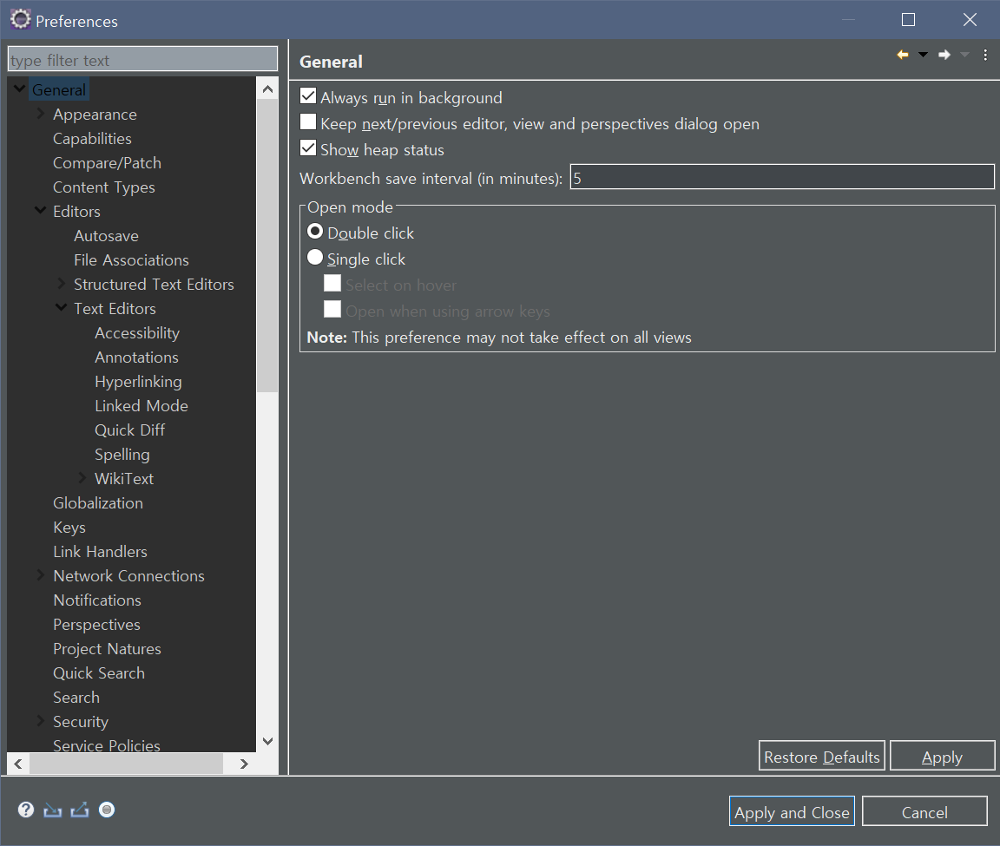
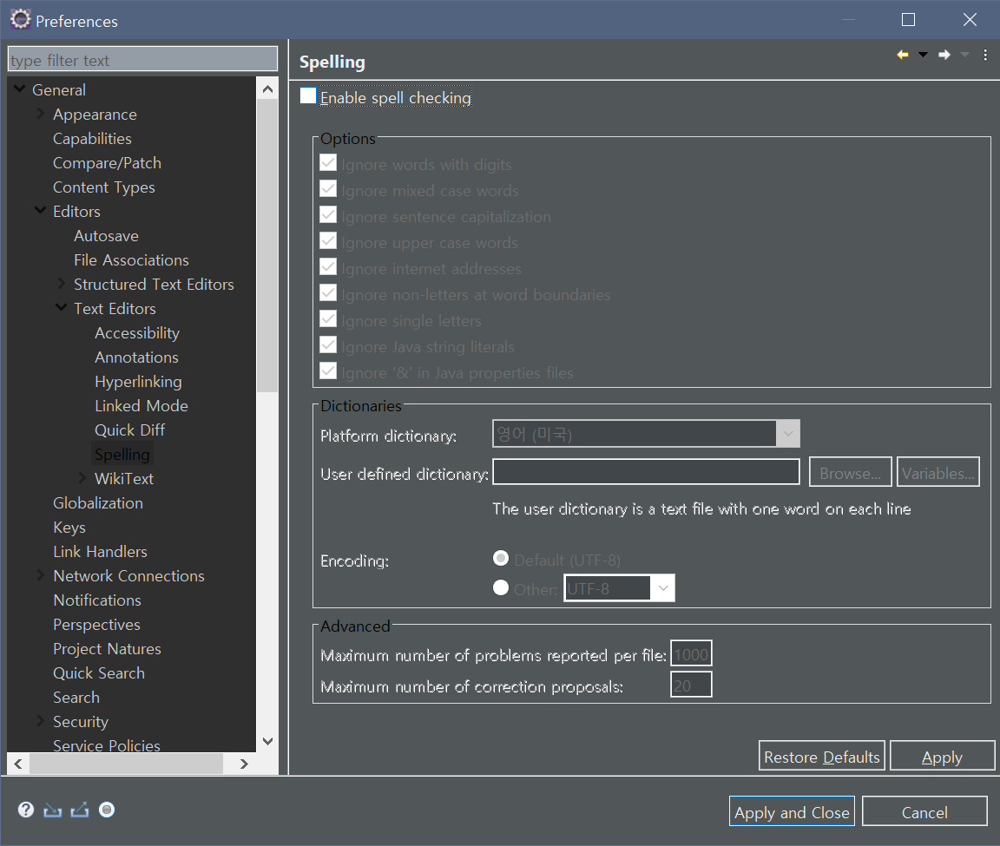
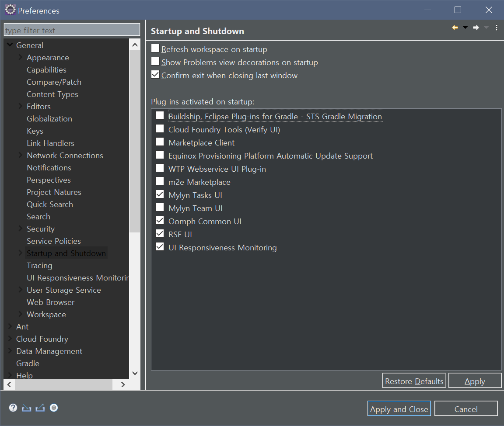
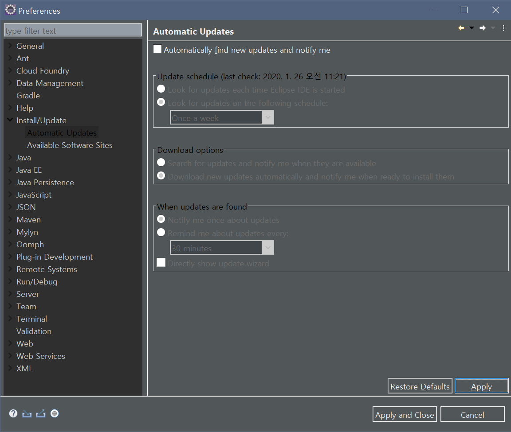
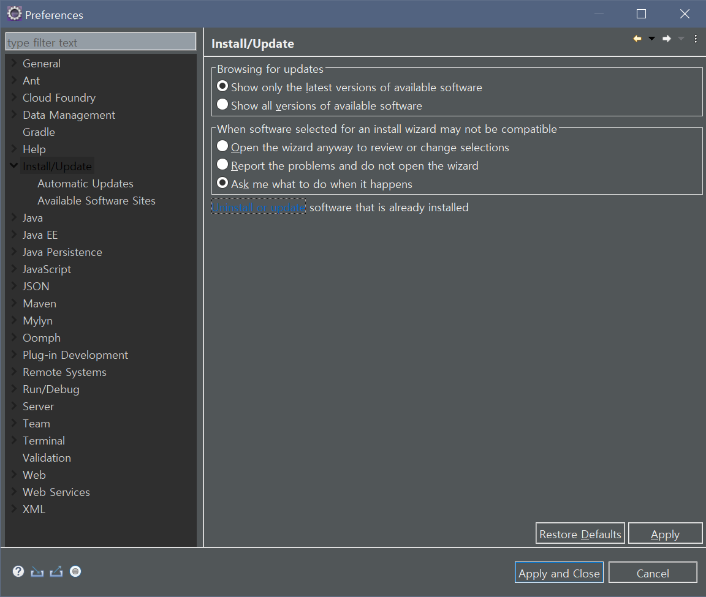
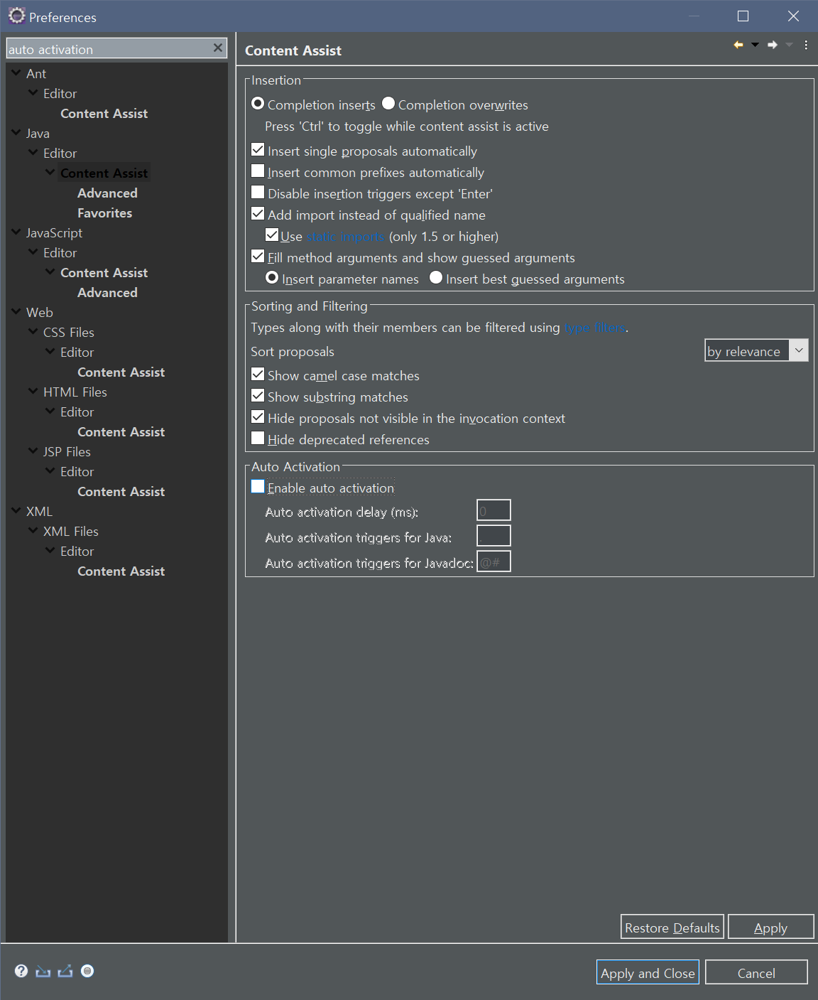
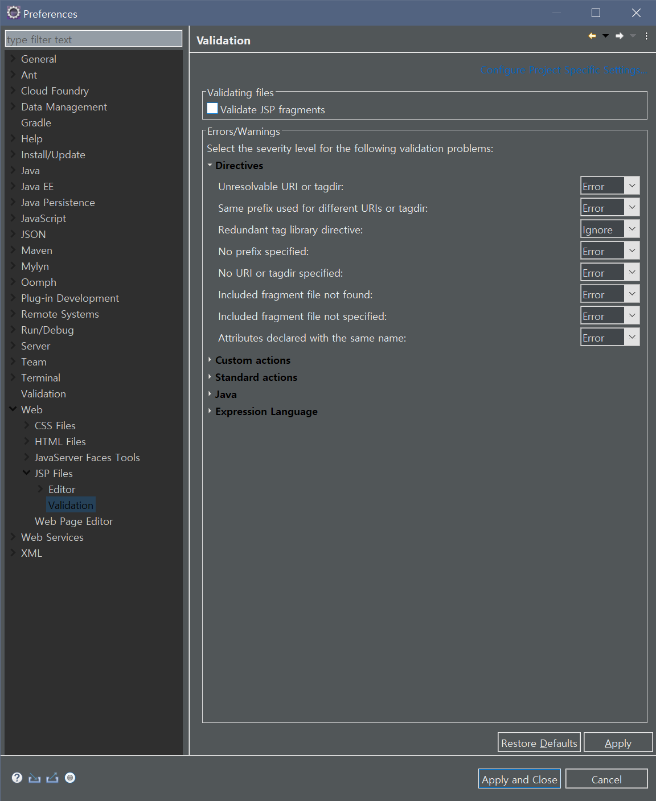
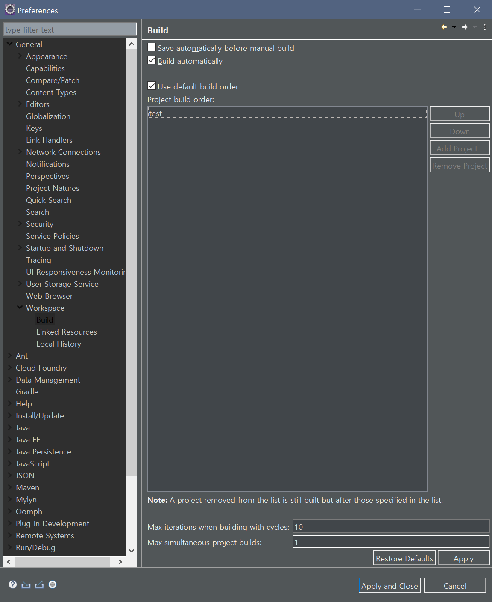

## Eclipse 최적화 설정 
1. eclipse.ini 파일 설정.
2. 인코딩 설정.
3. 메모리 사용 상태 표시.  
  * `Windows > Preferences > General > Show Heap Status` 체크.  
  
4. Spell Checking 해제.  
  * `Windows > Preference > General > Editors> Text Editors > Spelling > Enable Spell Checking` 체크 해제.   
  
5. 실행/종료 속도 개선.    
  * `Windows > Preferences > General> Startup and Shutdown`에서 디폴트 플러그인 중 불필요한 플러그인 체크 해제.  
  
6. 자동 업데이트 해제  
  * `Windows > Preferences > Install/Updates > Automatic Updates` 체크 해제.  
  
7. 불필요한 플러그인 삭제.  
  * `Windows > Preferences > Install/Update` `Uninstall or Update` 창 열어서 불필요한 플러그인 삭제.  
  
8. 코드 자동완성 기능 해제.  
  * `Windows > Preferences > Java > Editor > Content Assist - Auto Activation - Enable Auto Activation` 체크 해제.  
  * `Windows > Preferences > JavaScript > Editor > Content Assist - Auto Activation - Enable Auto Activation` 체크 해제.  
  * `Windows > Preferences > HTML > Editor > Content Assist - Auto Activation - Enable Auto Activation` 체크 해제.  
  * `Windows > Preferences > XML > Editor > Content Assist - Auto Activation - Enable Auto Activation` 체크 해제.  
  
9. JSP 유효성 체크 해제.  
  * `Windows > Preferences > Web > JSP Files > Validation > Validate JSP Fragments` 체크 해제.  
  
10. 자동 빌드 기능 해제.
  * `Windows > Preferences > General > Workspace > Build Automatically` 체크 해제.  
  * BUT 이 설정은 Spring Project를 진행할 때 없으면 귀찮아 지므로 해제하지 않는다.
    