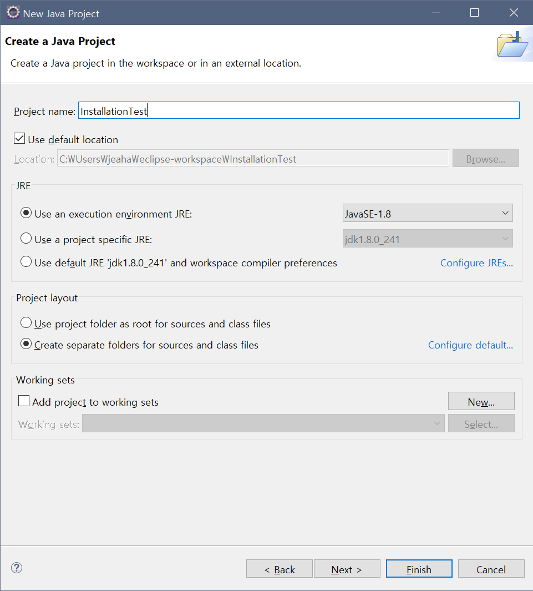

# Windows Eclipse 설치하기
## 설치
  1. 이클립스 설치 프로그램 [다운로드](https://www.eclipse.org/downloads/).
  2. `eclipse-inst-win64.exe` 실행.
  3. `Eclipse IDE for Enterprise Java Developers` 선택.  
    
  4. JVM과 설치 경로 지정  
    - `JVM` 선택에서 JRE가 아닌 JDK 선택.    
    - `Installation Folder`에서 적절한 경로 지정.  
    
  5. 동의 할게 뜨면 동의 하고 설치 진행.  
    
  6. 설치 완료 후, 실행.
    
  7. JAVA로 작업할 파일들이 저장될 경로 (Workspace) 지정.
      
    
## 설치 확인을 위한 테스트
  1. 새 프로젝트 생성.  
    `(ctrl + n) -> Java Project`  
    
  2. 프로젝트 이름 지정.  
    
  3. finish.  
    
  4. 테스트 프로젝트의 패키지 생성.  
    `(ctrl + n) -> package`  
    
  5. `test`로 패키지 이름 지정.  
    
  6. `Test.class` 파일 생성.
    `(ctrl + n) -> class`  
    
  7. `public void main(String[] args)` 체크 후 생성.
    
  8. 간단한 출력문 추가.  
      ```
        System.out.println("HI");
      ```
  9. `ctrl + f11`으로 실행.  
    