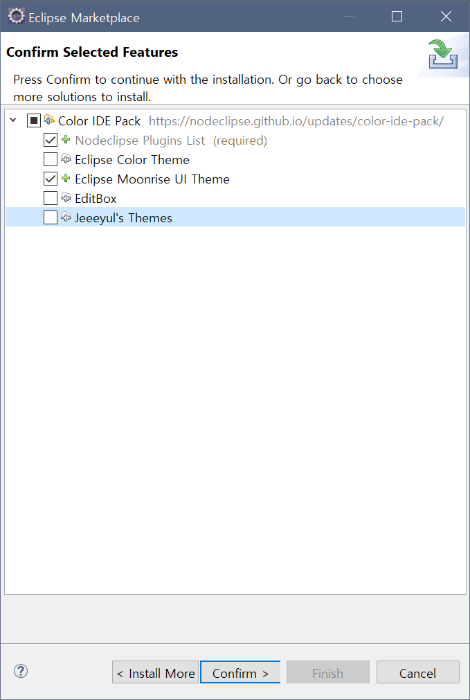

# Eclipse Theme 설정
이클립스를 설치하고 실행하면 하얗고 밝은 화면을 볼 수 있음.  
테마 변경으로 눈의 피로를 덜 받게 해서 조금이나마 시력 보호를 할 수 있음.  
나는 `moonrise`라는 Eclipse 테마와 `Dark Visual Studo`라는 폰트 테마를 적용해서 사용하는걸 좋아함.  
**주의 할 점**이 있는데 설정하다 꼬일 수 있으므로 **workspace 백업** 해두는 것을 권장함!!

  
## Eclipse Thme 적용
- `Help - Eclipse Marketplace` 실행.
- `moonrise`를 검색하면 `Color IDE Pack` 이란게 뜸.  
  예전엔 moonrise 테마만 따로 있었는데 패키지로 모아서 올렸나봄.  
  
- `Eclipse Moonrise UI Theme` 만 선택해서 설치하도록 함.  
  
- 동의 후, 설치. 이후 Eclipse 재시작을 함.  
  
- Eclipse가 다시 시작 되면 Windows > Prefrence > General > Apperance 에서 Theme를 확인, 여러가지 버전의 Moonrise 테마가 있고, windows에 설치한다면 `MoonRise (standalone)`을 선택 하면 됨.  
  이클립스 테마가 변경되는게 확인 되지만 이클립스를 한번 더 재시작 하라고 뜸.  
  
  
## Font Theme 설정
폰트 테마 역시 마켓 플레이스에서 받을 수 있지만, 나는 다음 링크의 테마가 마음에 들어서 이걸 다운받고 적용하기로 함.  
[LINK](http://www.eclipsecolorthemes.org/?view=theme&id=5211)  
이곳에 접속하면 다른 테마들도 많으니 골라서 설치 할 수도 있음.  
- `Eclipse Color Theme (EPF)` 저장.
  
- Windows > Prefrence > General > Apperance > Colors and Fonts 창으로 들어감.
- 창 왼쪽 하단의 Import 선택, 방금 받은 파일을 지정후 finish, Eclipse 재시작.
  
- 적용된걸 확인할 수 있음.
  