# 윈도우 버전 GIT 설치하기
1. Git 설치 파일을 다운
[git download](https://git-scm.com/downloads)  
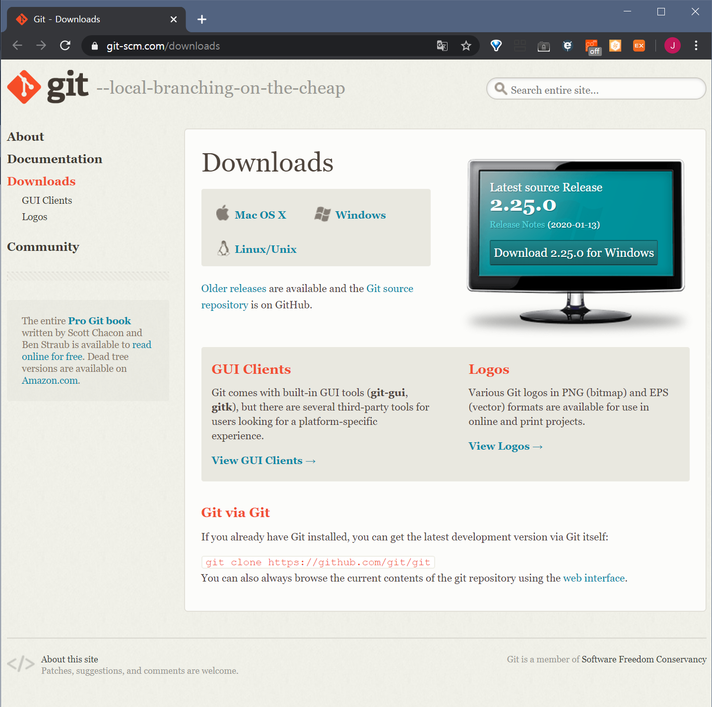
2. 설치 시작 NEXT
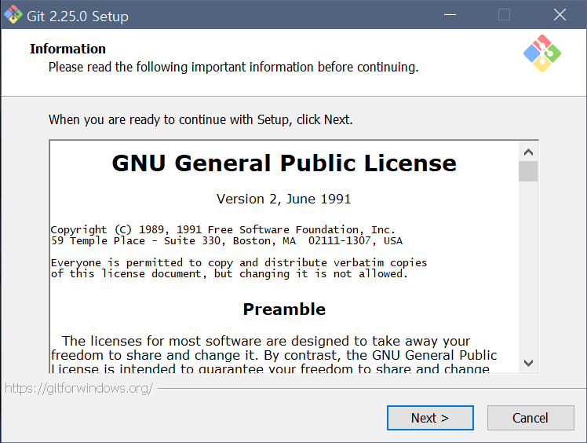  
3. NEXT
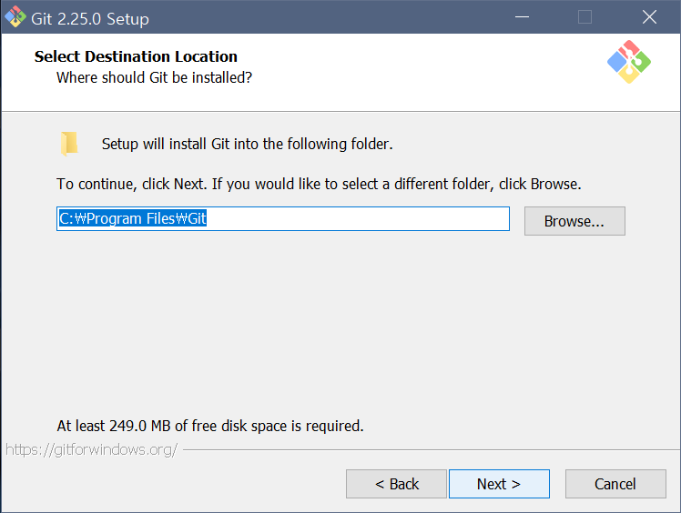  
4. NEXT
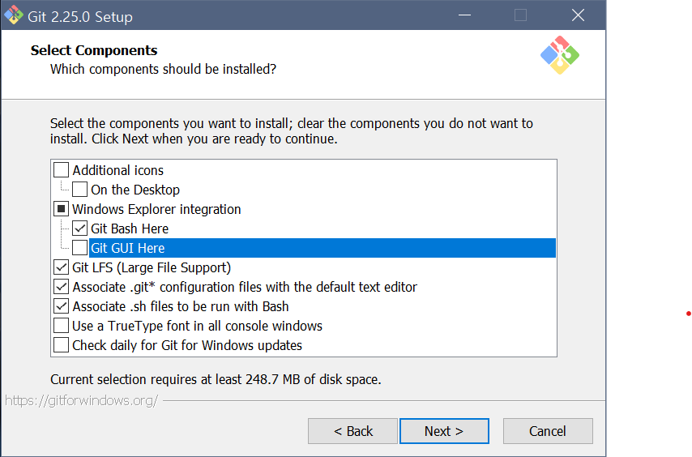
5. NEXT
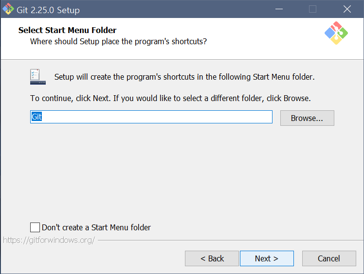
6. NEXT
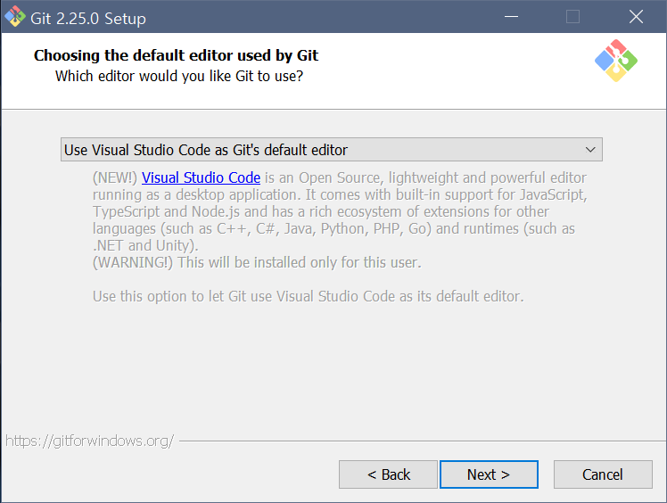
7. NEXT
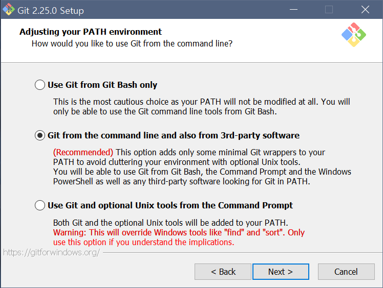
8. NEXT
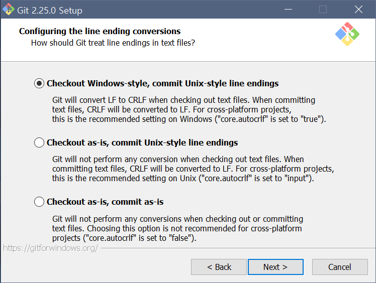
9. NEXT
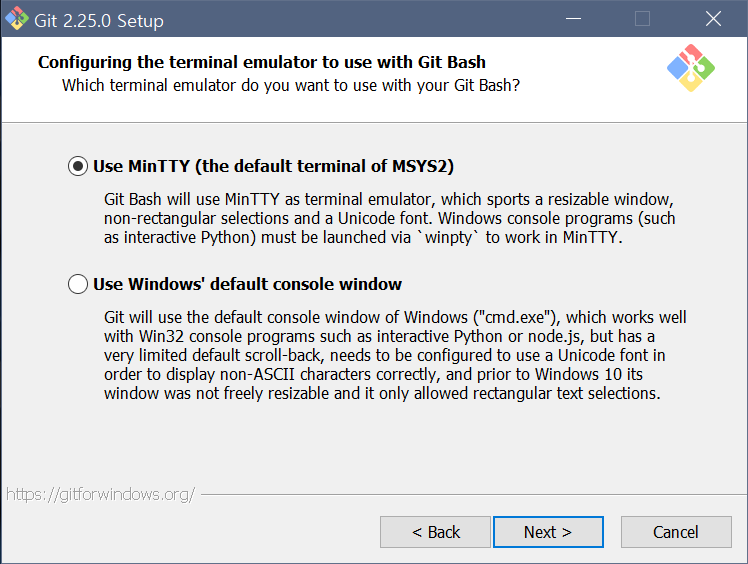
10. NEXT
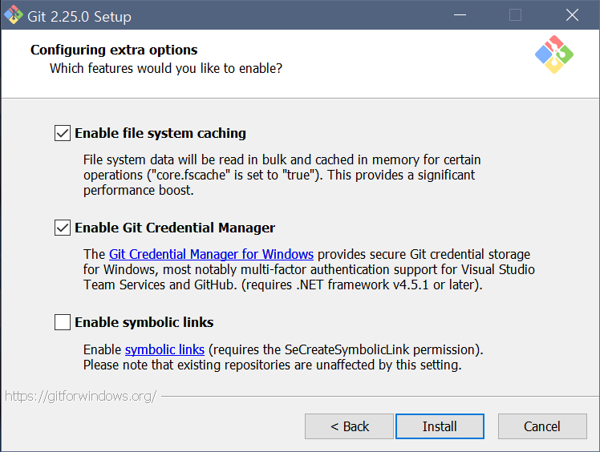
11. 설치 진행
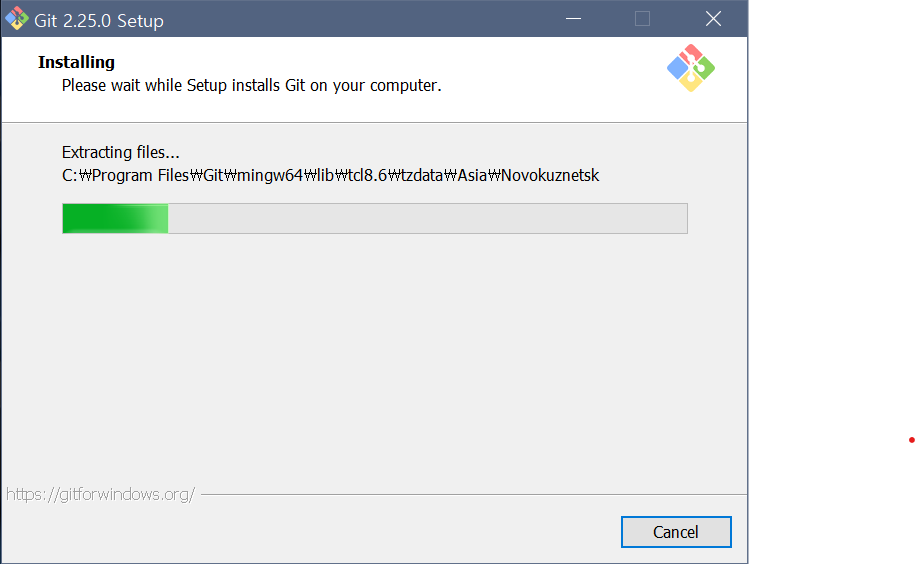
12. 설치 완료
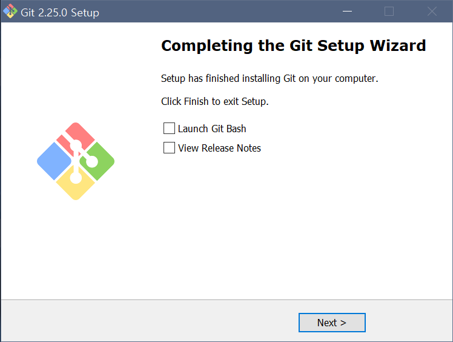
13. git에 사용자의 이름과 이메일 설정 후 설정 확인
```
  git config --global user.name '사용자 이름'
  git config --global user.email '이메일 주소'
  git config --list
```
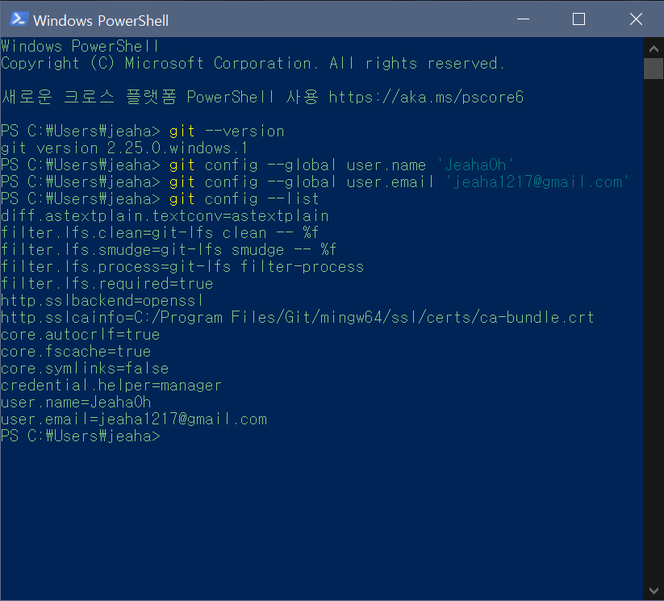

14. github에서 repository clone
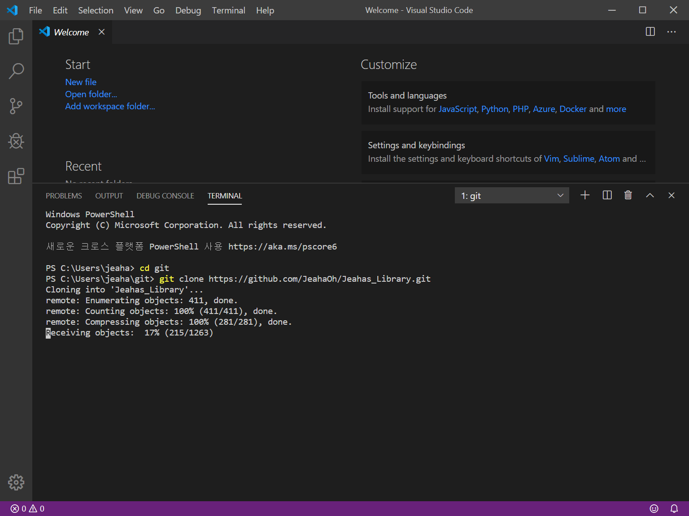
15. clone 한 repository open
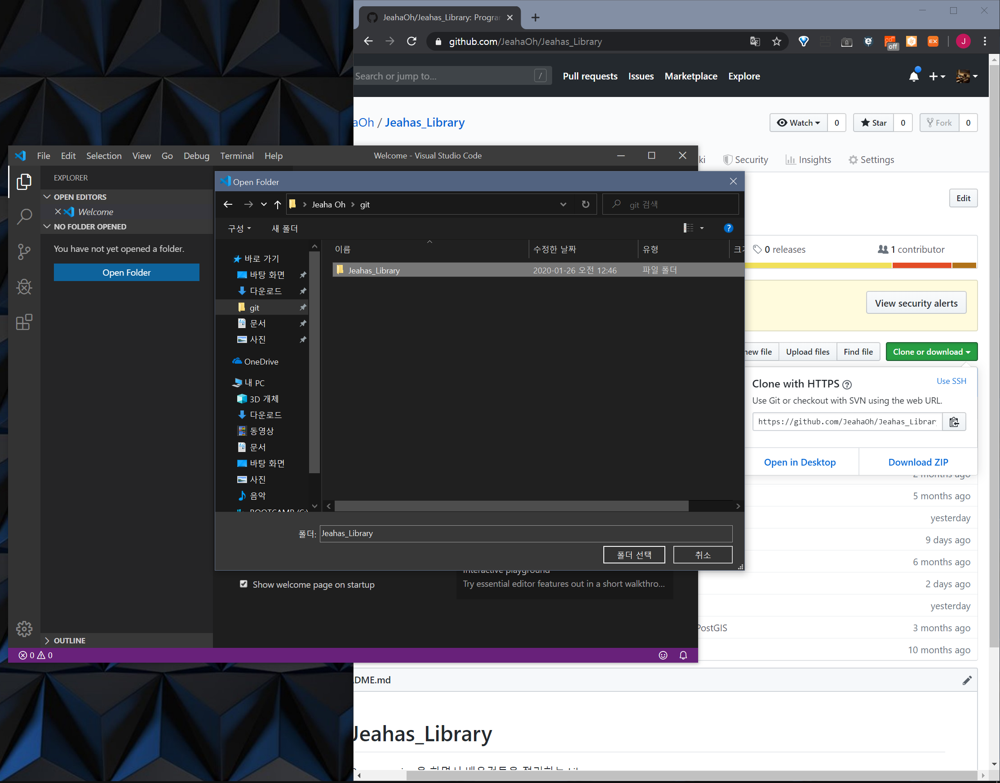
16. 간단한 수정 후 commit 시도
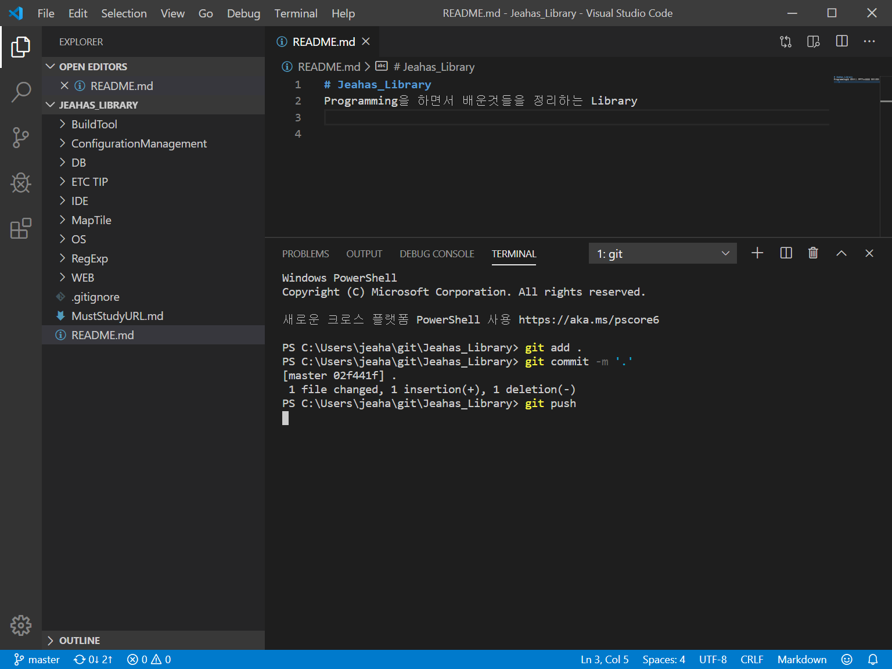
17. github login
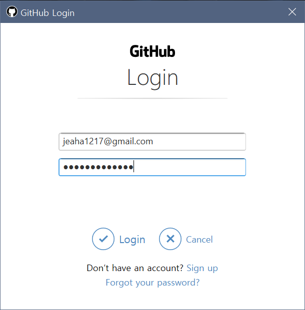
18. 로그인 후 commit 성공
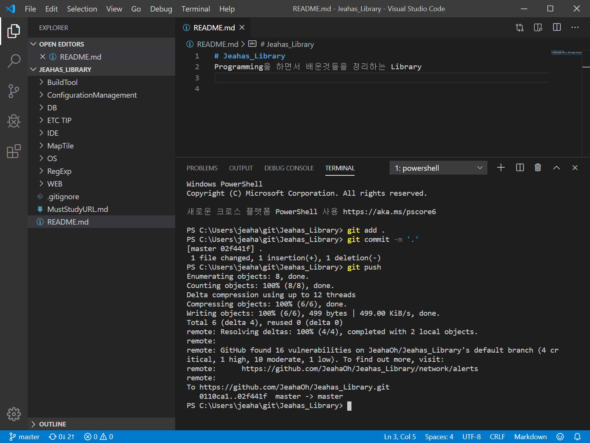

