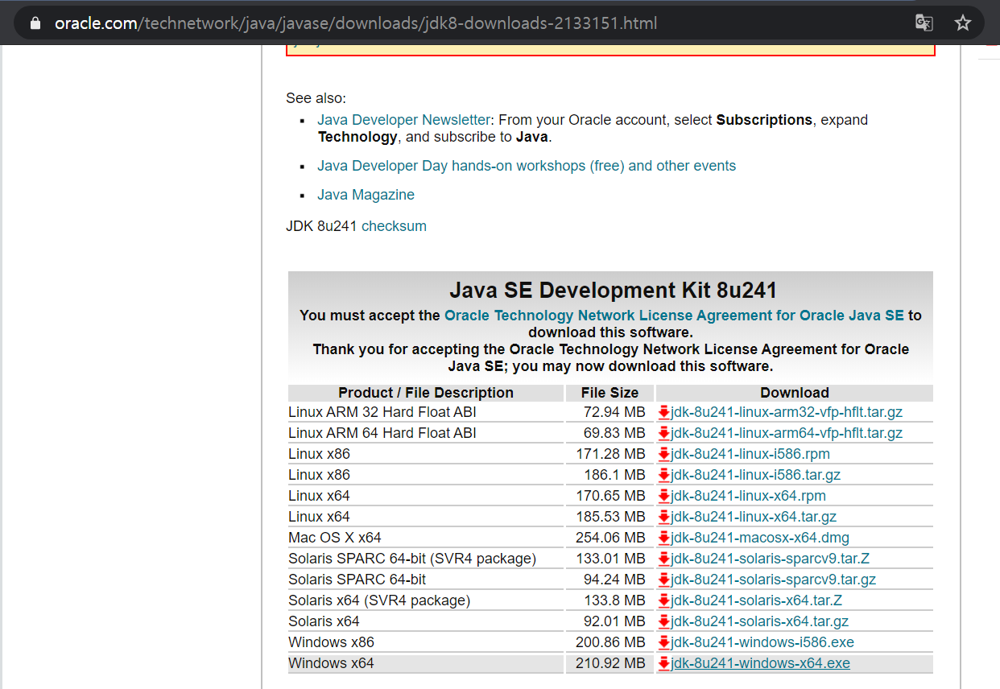
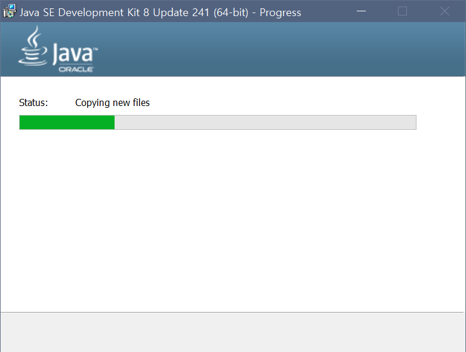
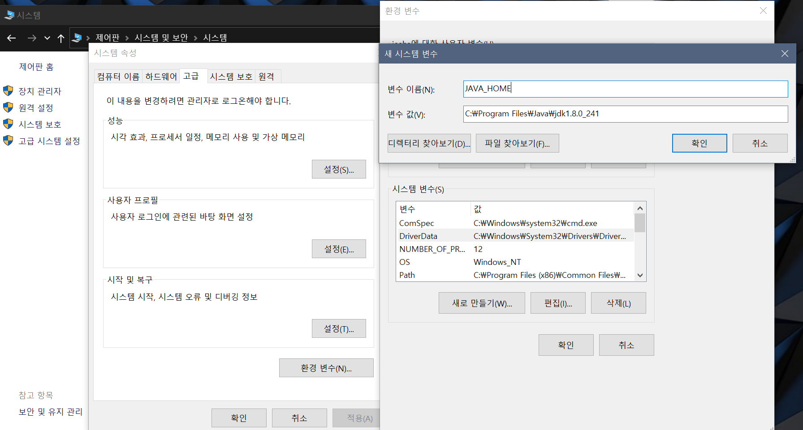
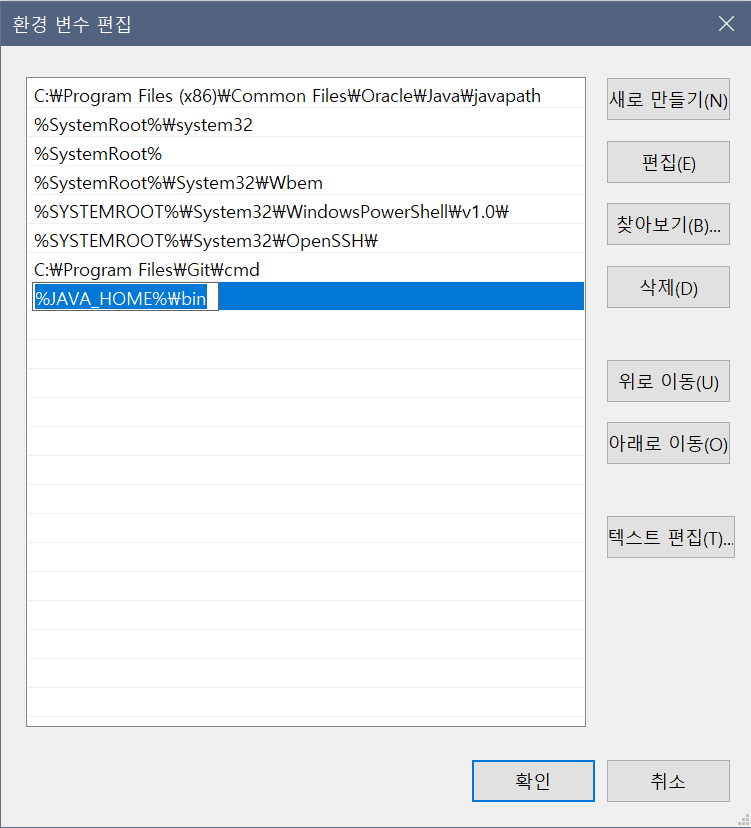

# JDK 설치하기
1. JDK 선택
  - Oracle JDK와 OpenJDK 그리고 버젼.  
  Oracle이 JDK를 년 단위 구독형 유료 라이센스로 전환하게 되면서 OracleJDK와 OpenJDK에서 선택 하게 되었음.  
  알아서 선택 하겠지지만,  
  기업에서 라이센스가 있다면 Oracle JDK를 설치하고,  
  그게 아니라면 Open JDK를 설치하면 됨.

2. JDK 다운로드
  - OracleJDK을 설치한다면  
  https://www.oracle.com/technetwork/java/javase/downloads/index-jsp-138363.html   
  에서 버젼을 선택 한 뒤 로그인을 하고 다운로드 하면 됨.  
  

  - OpenJDK를 설치하려면  
  https://github.com/ojdkbuild/ojdkbuild    
  에서 버젼을 선택한 뒤 다운로드 하면 됨.   
  
3. 설치
  일단 두 버젼 다 설치해 보도록 하겠음.
  - OracleJDK는 설치파일을 실행하면 됨.  
  
  - OpenJDK는 압축을 푼 뒤 위치 시키고 싶은 경로에 폴더를 넣어주면 됨.  
  나는 OracleJDK의 설치경로 `C:\Program Files\Java\`와 같은 경로에 위치 시키겠음.  
  
4. 환경 변수 설정창 오픈  
    `제어판 -> 시스템 및 보안 -> 시스템`으로 들어간 후,  
    `고급 시스템 설정 -> 환경변수` 선택.  
    `시스템 변수 -> 새로 만들기` 선택.  
5. JAVA_HOME 변수 설정  
  변수 이름 : JAVA_HOME  
  변수 값 : C:\Program Files\Java\jdk1.8.0_241  
  값은 jdk의 bin 폴더 앞까지의 경로를 넣어줌.  
  
6. PATH 변수 편집  
  - 새로만들기 선택 후, `%JAVA_HOME%\bin`를 입력해줌.    
  
  
7. JAVA 실행 및 버전 확인.  
  cmd 또는 Powershell을 실행한 뒤 자바 버전을 확인해야 함.  
  두 개의 명령어에 반응이 있어야 정상적인 설치가 됐고, 코딩 할 준비가 됨.  
    ```
      java -version
      javac -version
    ```  
  


